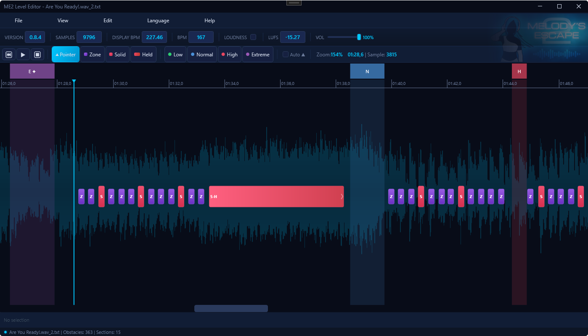

<p align="center">
  
</p>

<h1 align="center">ME2 Level Editor</h1>

<p align="center">
  A community-built level editor for <strong>Melody's Escape 2</strong> — create, edit, and fine-tune levels with a visual timeline interface.
</p>

<p align="center">
  <a href="https://github.com/ItemME/ME2LevelEditor/releases/latest">
    
  </a>
  
  
</p>

---

## Features

- **Timeline editor** — Zoomable waveform view with playhead tracking, drag-select, and multi-selection
- **Obstacle placement** — Place zone, solid tap, and held obstacles directly on the timeline or live during audio playback
- **Intensity sections** — Define Low, Normal, High, and Extreme sections with Angel Jump transitions
- **Audio playback** — Load and play MP3, OGG, WAV, FLAC files with transport controls
- **Editing tools** — Full undo/redo, property inspector, metadata editing (BPM, loudness, samples)
- **Level cache support** — Open and save ME2 level cache files (v0.8.1 and v0.8.4 formats)
- **Localization** — Available in English, French, Italian, and Spanish

### Keyboard Shortcuts

| Shortcut | Action |
|----------|--------|
| `Ctrl+O` | Open file |
| `Ctrl+S` | Save file |
| `Ctrl+Z` / `Ctrl+Y` | Undo / Redo |
| `Ctrl+A` | Select all obstacles |
| `Ctrl+0` | Zoom to fit |
| `Space` | Play / Pause |
| `Delete` | Delete selected |
| `Esc` | Switch to pointer tool |
| `1`–`3` | Obstacle tools (Zone, Solid, Held) |
| `4`–`7` | Section tools (Low, Normal, High, Extreme) |
| `Home` / `End` | Jump to start / end |

Live placement keys are fully customizable via **Edit > Key Mappings**.

---

## Download

Download the latest release from the [**Releases page**](https://github.com/ItemME/ME2LevelEditor/releases/latest).

Extract the archive and run `ME2LevelEditor.exe`. No installation required.

**Requirements:** Windows 10+ with [.NET Framework 4.8](https://dotnet.microsoft.com/download/dotnet-framework/net48)

---

## Building from Source

### Prerequisites

- **Visual Studio 2019+** with the **.NET desktop development** workload
- **.NET Framework 4.8** targeting pack

### Steps

1. Clone the repository:
   ```bash
   git clone https://github.com/InsaneHawkDev/ME2LevelEditor.git
   ```

2. Open `ME2LevelEditor/ME2LevelEditor.sln` in Visual Studio.

3. Restore NuGet packages.

4. Build the solution.

### Dependencies

| Package | Purpose |
|---------|---------|
| [NAudio](https://github.com/naudio/NAudio) | Audio file loading and playback |
| [NAudio.Vorbis](https://github.com/naudio/Vorbis) | OGG Vorbis format support |

---

## Legal

This editor is an **independent community tool** created by **InsaneHawk**.

It is **not affiliated with, endorsed by, or connected to Loïc (Icetesy)**, the creator of Melody's Escape 2.

Melody's Escape 2 is the property of its respective owner. All game-related trademarks and copyrights belong to their respective holders. This tool interacts only with user-generated level cache files and does not distribute any game assets.
